= Cheatsheet APEX (Noch nicht fertig)

== Tree

=== SQl Code

[source,sql]
----
select 0 as status,
       3 as einrueck,
       (select s.starname from star s where s.starnum = m.starnum) as title,
       null as icon,
       m.mvnum as mvnum,
       null as tooltip,
       apex_util.prepare_url('f?p='||:app_id||':1:'||:app_session||':T:::P1_Starnum:'|| m.starnum) as link from movstar m
       -- :1: ist die Page Seite | :P1_Starnum: ist der Parameter (Löschen beim einfügen bitte)
union
select 1,
       1,
       'alle filme' as title,
       null,
       0 as mvnum,
       null,
       null from dual
union
select -1,
        2,
        mvtitle as title,
        null,
        mvnum,
        null,
        null from movie order by mvnum
----

* *1* ist der Stamm (oberste)
* *-1* sind die Äste
* *0* sind die Blätter

.Ausgabe
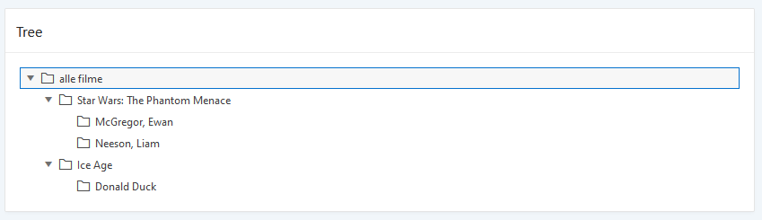

Hier wird dann nur beim _Click_ die Id mitgegeben. Um den Namen oder anderes in den Textfields zu bekommen, muss man das dann *Selecten*.

=== Andere Felder

IMPORTANT: Bei jedem Textfeld ein *SELECT* schreiben.

.Select statemend für andere Zeilen
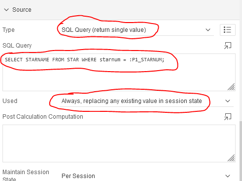

== Images ("POST")

.Wenn Button gedrückt wird wird der Process augeführt
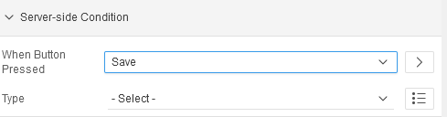

.Save Process
[source,sql]
----
declare
    v_blob blob;
    v_thum blob;
    v_mimeType varchar2(4000); --Braucht man nicht unbedingt
    v_count number;

    v_oi_bild   ordimage := null;
    v_oi_thumb  ordimage := null;

begin

    apex_debug.message('P1_UPLOAD: %s', :P1_UPLOAD); --debug option optional

    select count(*) into v_count from apex_application_temp_files
          WHERE name = :P1_UPLOAD; -- gibts eine file?

     if v_count != 0 then
              SELECT blob_content , mime_type -- optional | file wird selected
      INTO v_blob, v_mimeType
      FROM apex_application_temp_files
      WHERE name = :P1_UPLOAD; -- UPLOAD ist die file

     v_oi_bild  := ordimage(v_blob);
     v_oi_bild.setproperties();
     v_oi_thumb := ordimage(v_thum);

     -- Thumbnail generieren
     v_oi_bild.processcopy(
       command => 'maxScale=100 100',
       dest    => v_oi_thumb
     ); --maxScale -> größe

    v_thum := v_oi_thumb.getContent(); -- zuweisung
    end if;

    UPDATE star
    SET STARNAME = :P1_STARNAME,
        BIRTHPLACE = :P1_BIRTHPLACE,
        CNTRYID = :P1_CNTRYID,
        STARBORN = :P1_STARBORN,
        STARDIED = :P1_STARDIED,
        SEX = :P1_SEX,
        DEATHCAUSE = :P1_DEATHCAUSE,
        THUMBNAIL = v_thum --,
        --MIMETYPE = v_mimeType
    where STARNUM = :P1_STARNUM;

end;
----

IMPORTANT: Die einzelnen Felder müssen gleich sein

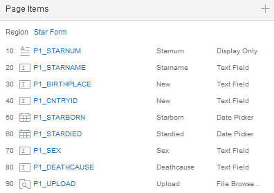

.neue column (Blob)
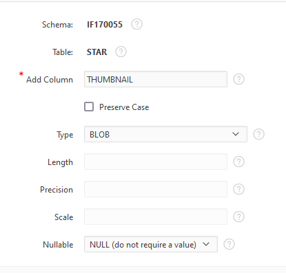

== Wichtiges aus dem Doodle Beispiel

*Credit: link:https://htl-profis.github.io/doodle-anleitung/[htl-profis-doodle]*

=== Create Tables

SQL Workshop->SQL Commands

IMPORTANT: Die Befehle nach der Reihe einfügen

[source,sql]
----

CREATE TABLE abstimmung(
    kopfid NUMBER(5, 0) NOT NULL,
    name VARCHAR2(100),
    CONSTRAINT pk_abstimmung PRIMARY KEY(kopfid)
);

CREATE TABLE abstimmung_position(
    kopfid NUMBER(5, 0) NOT NULL,
    posid NUMBER(5, 0) NOT NULL,
    termin DATE,

    CONSTRAINT pk_abstimmung_position PRIMARY KEY(posid),
    CONSTRAINT fk_abstimmung FOREIGN KEY(kopfid) REFERENCES abstimmung(kopfid)
)

CREATE TABLE abstimmung_ergebnis(
    ergid NUMBER(5, 0),
    posid NUMBER(5, 0),
    name VARCHAR2(1000),
    ergebnis VARCHAR2(1),

    CONSTRAINT pk_abstimmung_ergebnis PRIMARY KEY(ergid),
    CONSTRAINT fk_abstimmung_position FOREIGN KEY(posid) REFERENCES abstimmung_position(posid),
    CONSTRAINT chk_abstimmung_ergebnis CHECK(UPPER(ergebnis) LIKE 'Y' OR UPPER(ergebnis) LIKE 'N')
)

----

=== Sequence erstellen

-> SQL-Workshop +
-> Object Browser +
-> Rechts aufs Plus +
-> Sequence +
-> Jeweiligen Namen in Sequence Name +
-> Next +
-> Create Sequence +

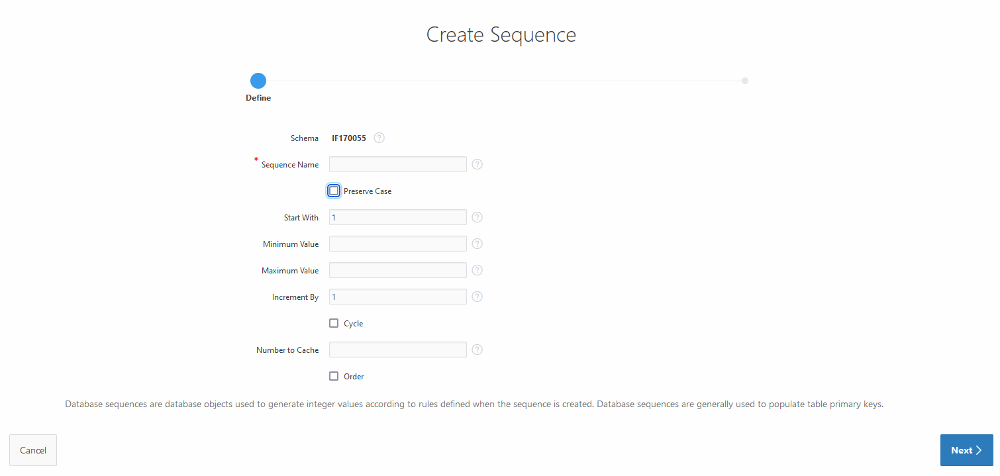

== Allgemein Wichtiges

=== Classic Report

Report findet man unter:

Regions->Classic Report

Rechts unter Source Findet man auch die SQL Query um den Report zu füllen.

.Einfacher Report mit den Werten einer Tabelle.
image::images/image-2021-12-15-12-22-13-858.png[]

=== Diagramme

Diagramme findet man unter  Layout -> Regions -> Chart

.Links das erstellte Diagram | Rechts die Oprion Chart
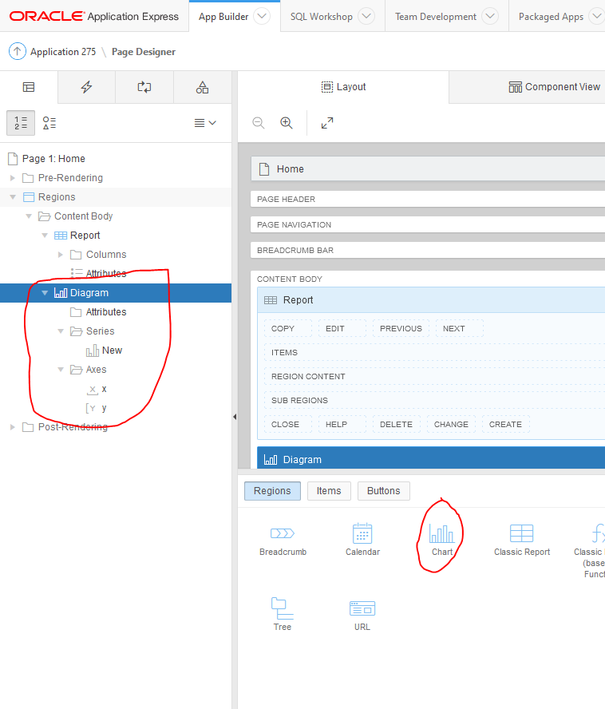

Unter *Atributes* kann man auswählen was für ein Diagramm es sein soll.

Atributes->(rechts) Chart->Type->`Auswahl Diagramtyp`

Unter *Series* kann man die Diagramme dann "Zeichnen". Wenn man z.B. eine neue Serie erstellt wird eine neue Linie gezeichnet. +
Wenn man auf eine *Serie* _Clicky Clicky_ macht, hat man die Option eine SQL Query einzugeben.

Series->New->(rechts) Source->Type: SQL Query->SQL Query

*Beispiel für Linien Diagramm mit SQL Query:*

.Es wird der umsatz mit dem Jahr+Monat in X gespeichert | Das wird als _Label_ verwendet
[source, sql]
----
Select umsatz_eur,CONCAT(CONCAT(Monat, ' '), Jahr) AS X from verkauf
----

.Einistellung
image::images/image-2021-12-15-14-51-55-390.png[]

.Output
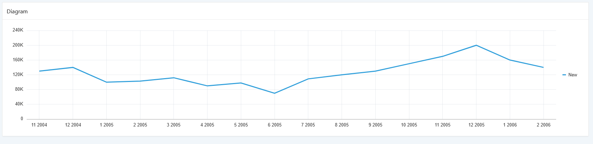

=== Process

Um einen Process zu erstellen, geht man unter:

Component View->Page Processing->Process->+

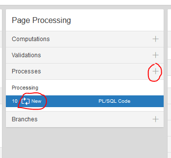

Wenn man dann auf new _Clicky Clicky_ macht, kann man rechts einstellen was der Process machen soll.

.Einstellung des Processes
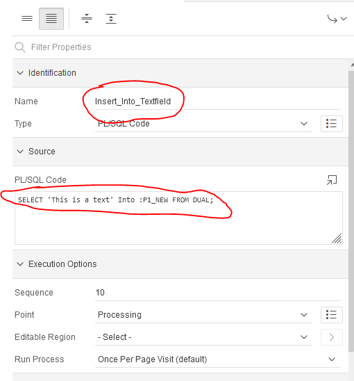

In dem PL/SQL Code Block schreibt man was der Process machen soll. Hier z.B. setzt er einen Text in ein Textfield.

Hier wird der Auslöser definiert:

.When Button Pressed
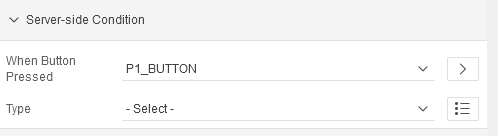

Wenn man aber einen Process `After Submit` auslösen möchte, stellt man das hier ein:

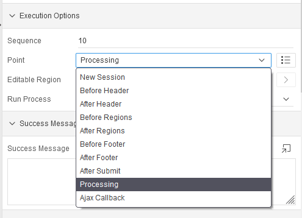

== Images

Wenn man Bilder einfügen möchte, geht man rechts oben auf das Zeichen mit den Symbolen.

*Location:*

.Location wo das Foto Hochgeladen wird
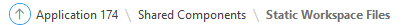

.Bild aussichen und dann *Upload*
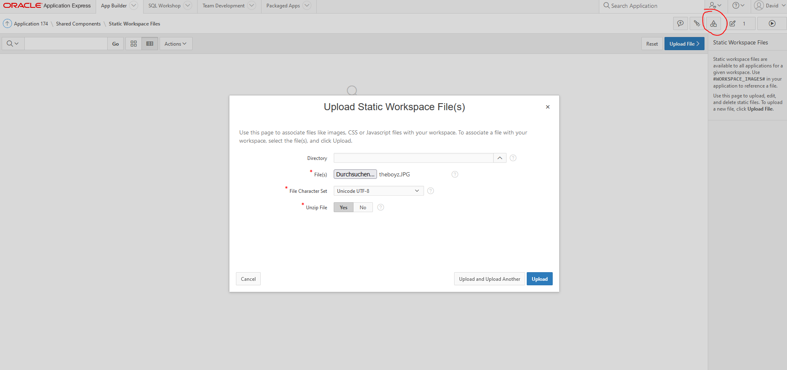

.Was nach dem # kommt is der Path
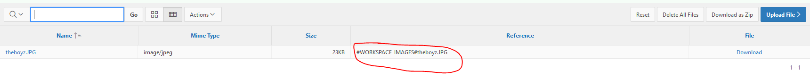

.Bild Anzeigen
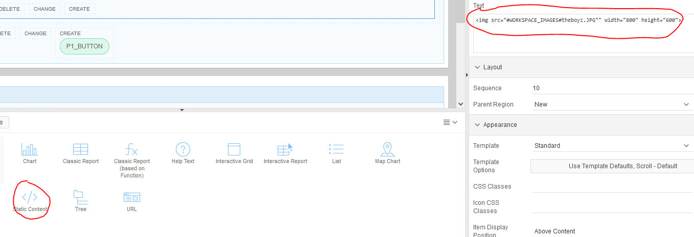

.static content

[source,sql]
----

----

== Redirect

Um einen Link zu erstellen, verwenden wir z.B. einen Report mit einer Column.

.Ausgewählte Column
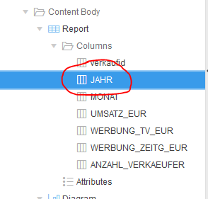

Rechts dann unter Identification->Type und dann die gewählte Zeile wählen.

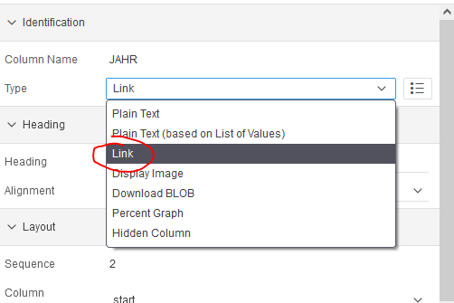

Weiter unten auf der rechten Seite dann unter Link das auswählen was gemacht werden soll.

.Target auswählen also Seite | und den Link Text also das was angezeigt wird
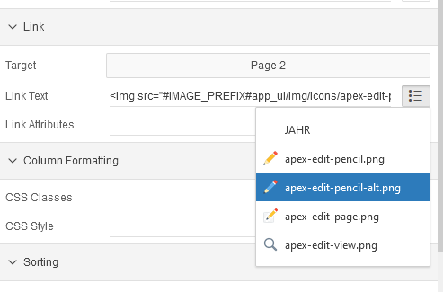

.Beim Target folgendes auswählen um einen Text auf der zweiten Seite anzeigen zu lassen
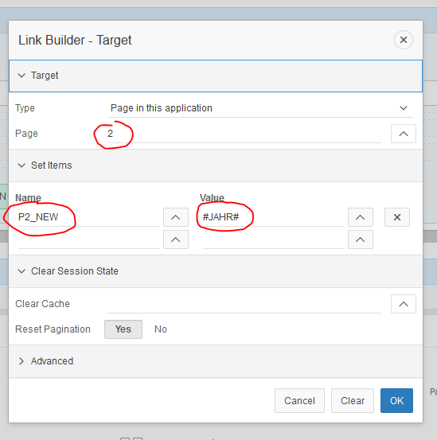

== Tree Emp

[source,sql]
----
select case when connect_by_isleaf = 1 then 0
            when level = 1             then 1
            else                           -1
       end as status,
       level,
       "ENAME" as title,
       null as icon,
       "EMPNO" as value,
       null as tooltip,
       null as link
from "#OWNER#"."EMP"
start with "MGR" is null
connect by prior "EMPNO" = "MGR"
order siblings by "ENAME"

----

