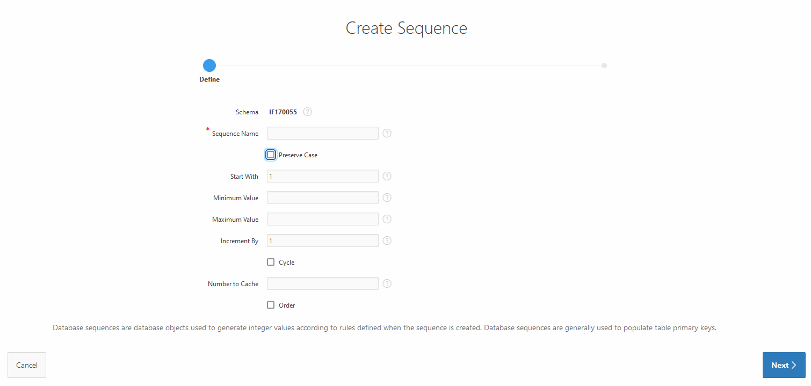
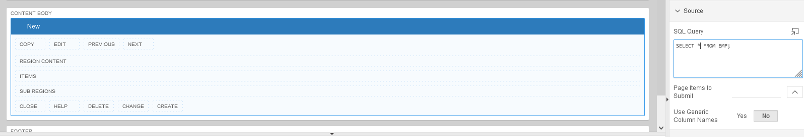
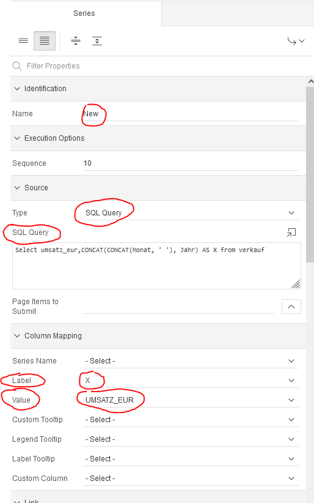
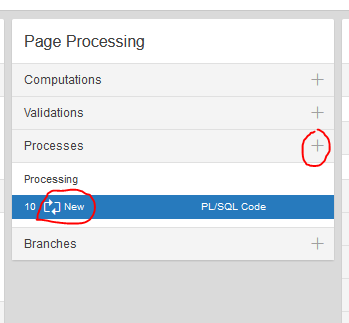
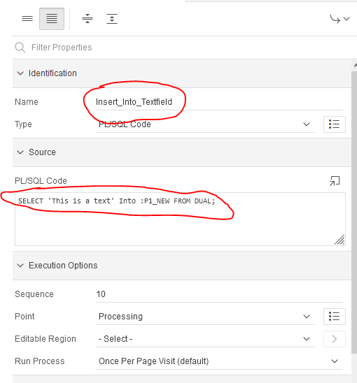
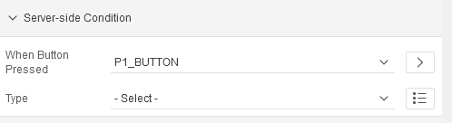
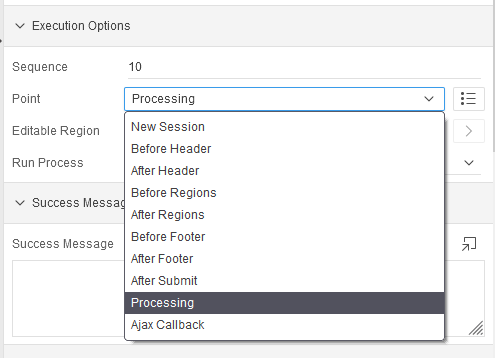

= Cheatsheet APEX

== Tree SQl Code

[source,sql]
----
select 0 as status,
       3 as einrueck,
       (select s.starname from star s where s.starnum = m.starnum) as title,
       null as icon,
       m.mvnum as mvnum,
       null as tooltip,
       apex_util.prepare_url('f?p='||:app_id||':2:'||:app_session||':T:::P2_Starnum:'||(select starnum from star s where s.starnum = m.starnum)) as link from movstar m
union
select 1,
       1,
       'alle filme' as title,
       null,
       0 as mvnum,
       null,
       null from dual
union
select -1,
        2,
        mvtitle as title,
        null,
        mvnum,
        null,
        null from movie order by mvnum
----

== Wichtiges aus dem Doodle Beispiel

*Credit: link:https://htl-profis.github.io/doodle-anleitung/[htl-profis-doodle]*

=== Create Tables

SQL Workshop->SQL Commands

IMPORTANT: Die Befehle nach der Reihe einfügen

[source,sql]
----

CREATE TABLE abstimmung(
    kopfid NUMBER(5, 0) NOT NULL,
    name VARCHAR2(100),
    CONSTRAINT pk_abstimmung PRIMARY KEY(kopfid)
);

CREATE TABLE abstimmung_position(
    kopfid NUMBER(5, 0) NOT NULL,
    posid NUMBER(5, 0) NOT NULL,
    termin DATE,

    CONSTRAINT pk_abstimmung_position PRIMARY KEY(posid),
    CONSTRAINT fk_abstimmung FOREIGN KEY(kopfid) REFERENCES abstimmung(kopfid)
)

CREATE TABLE abstimmung_ergebnis(
    ergid NUMBER(5, 0),
    posid NUMBER(5, 0),
    name VARCHAR2(1000),
    ergebnis VARCHAR2(1),

    CONSTRAINT pk_abstimmung_ergebnis PRIMARY KEY(ergid),
    CONSTRAINT fk_abstimmung_position FOREIGN KEY(posid) REFERENCES abstimmung_position(posid),
    CONSTRAINT chk_abstimmung_ergebnis CHECK(UPPER(ergebnis) LIKE 'Y' OR UPPER(ergebnis) LIKE 'N')
)

----

=== Sequence erstellen

-> SQL-Workshop +
-> Object Browser +
-> Rechts aufs Plus +
-> Sequence +
-> Jeweiligen Namen in Sequence Name +
-> Next +
-> Create Sequence +

== Allgemein Wichtiges

=== Classic Report

Report findet man unter:

Regions->Classic Report

Rechts unter Source Findet man auch die SQL Query um den Report zu füllen.

.Einfacher Report mit den Werten einer Tabelle.

=== Diagramme

Diagramme findet man unter  Layout -> Regions -> Chart

.Links das erstellte Diagram | Rechts die Oprion Chart
image::../images/image-2021-12-15-14-39-54-904.png[]

Unter *Atributes* kann man auswählen was für ein Diagramm es sein soll.

Atributes->(rechts) Chart->Type->`Auswahl Diagramtyp`

Unter *Series* kann man die Diagramme dann "Zeichnen". Wenn man z.B. eine neue Serie erstellt wird eine neue Linie gezeichnet. +
Wenn man auf eine *Serie* _Clicky Clicky_ macht, hat man die Option eine SQL Query einzugeben.

Series->New->(rechts) Source->Type: SQL Query->SQL Query

*Beispiel für Linien Diagramm mit SQL Query:*

.Es wird der umsatz mit dem Jahr+Monat in X gespeichert | Das wird als _Label_ verwendet
[source, sql]
----
Select umsatz_eur,CONCAT(CONCAT(Monat, ' '), Jahr) AS X from verkauf
----

.Einistellung

.Output
image::../images/image-2021-12-15-14-52-34-703.png[]

=== Process

Um einen Process zu erstellen, geht man unter:

Component View->Page Processing->Process->+

Wenn man dann auf new _Clicky Clicky_ macht, kann man rechts einstellen was der Process machen soll.

.Einstellung des Processes

In dem PL/SQL Code Block schreibt man was der Process machen soll. Hier z.B. setzt er einen Text in ein Textfield.

Hier wird der Auslöser definiert:

.When Button Pressed

Wenn man aber einen Process `After Submit` auslösen möchte, stellt man das hier ein:

